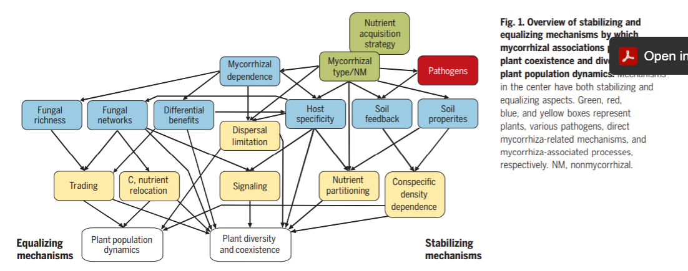

# How mycorrhizal associations drive plant population and community biology
*Leho Tedersoo, Mohammad Bahram, and Martin Zobel*  
# Published 2020 in Science
https://doi.10.1126/science.aba1223

# What they did and found
* This is a review article that succinctly summarizes how the presence and type of mycorrhizal association affect plant communities. 
* They argue that mycorrhizal fungi regulate seedling establishment and species coexistence through various stabilizing and equalizing mechanisms such as soil nutrient partitioning, feedback to soil antagonists, signaling, and nutrient trade. 
* They dive into differences in microbial-to-plants feedback by different mycorrhizal types. 

