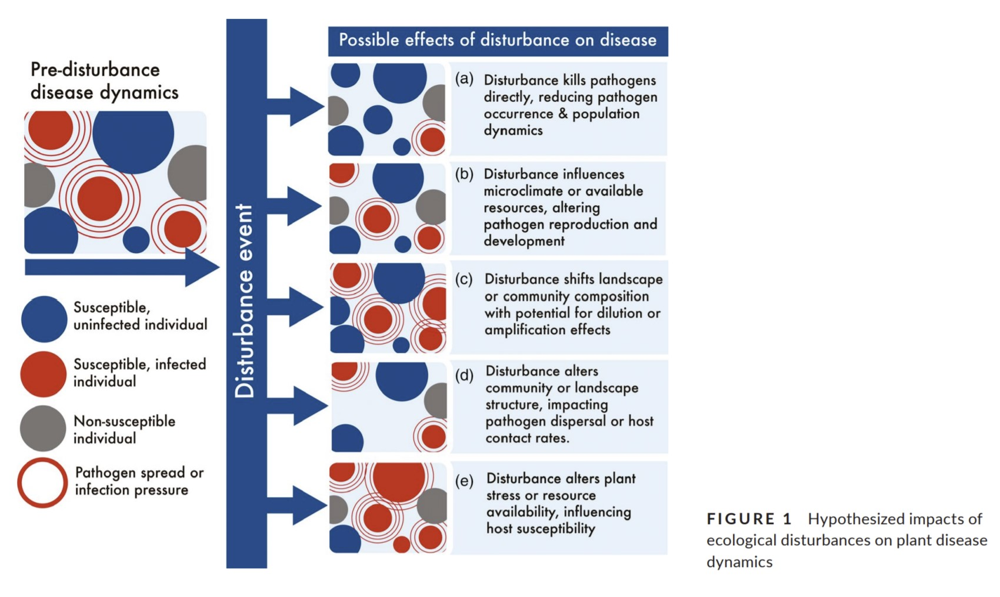

**Wildfire alters the disturbance impacts of an emerging forest disease via changes to host occurrence and demographic structure**

Allison B. Simler-Williamson, Margaret R. Metz, Kerri M. Frangioso, David M. Rizzo.

Journal of Ecology. 2021; 109: 676-691. https://doi.org/10.1111/1365-2745.13495

**Summary:**

This paper looks at interactions between the introduced pathogen *Phytophthora ramorum* (sudden oak death) and wildfire in coastal forests in Big Sur, CA. The authors use a combination of a long-term field dataset, fire history data, and Bayesian linear and GLMs to investigate the following questions:
1. Does fire history influence aspects of forest structure and composition in a way that changes the likelihood of sudden oak death spread?
2. Does fire history correlate with P. ramorum occurrence, infestation intensity, and disease-related
mortality (i.e. biotic disturbance severity)?
3. Using the 2008 Chalk and Basin fires as a casestudy: which mechanisms limit pathogen occurrence, reinvasion, infestation intensity and stem mortality?

**Findings:**

+ They found a negative interaction between recent or frequent wildfire and pathogen spread. Changes in forest composition (towards smaller bay laurel and tanoak host trees) as a result of frequent fire may help to limit pathogen spread.

+ In the case of the Chalk and Basin fires, they found that surviving adult host plants were largely responsible for post-fire disease spread but that regenerating younger plants did not significantly contribute to it. As a result, tree mortality caused by sudden oak death was reduced in recently burned areas that had lost mature tree canopies. 

**Why it's interesting:**

+ Previous research looking at fire and pathogen interactions has focused on the effect of sudden oak death on fuel build up (and how that would affect future fires), however this paper instead focuses on how past fires affect disease spread.