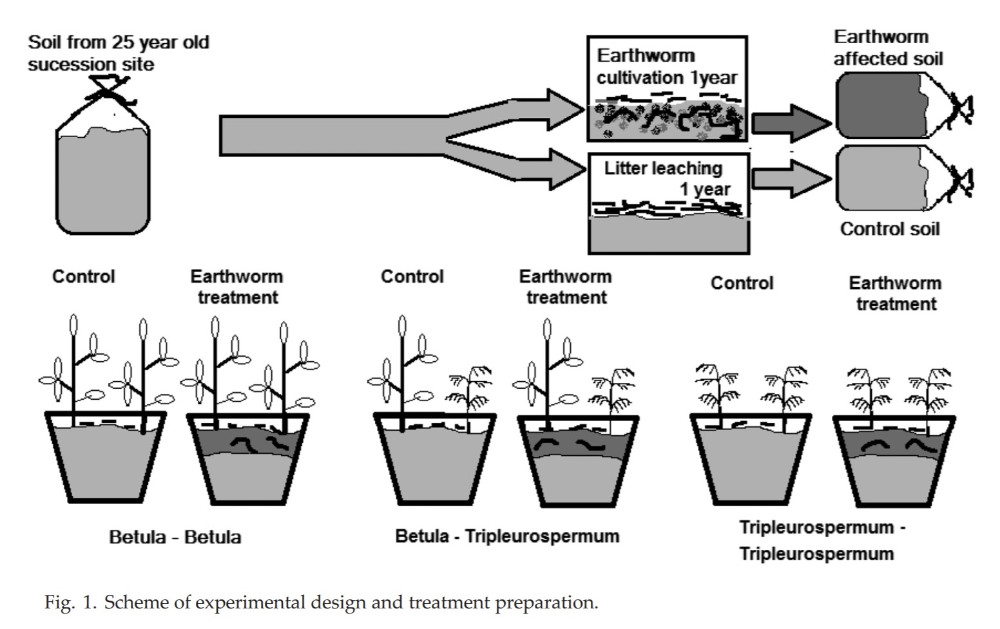

**Earthworms affect growth and competition between
ectomycorrhizal and arbuscular mycorrhizal plants**

Jan Frouz, Jabbar Moradi, David Püschel, Jana Rydlová

Ecosphere 10(5):e02736. 10.1002/ecs2.2736

**Summary:**

+ This study looks at whether earthworms alter the assymetric competition between ectomycorrhizal shrubs and trees and arbuscular mycorrhizal understory plants. They utilize a laboratory study to test the hypothesis that earthworm invasion favors plant growth and reduces the competitive edge of ectomyorrhizal plants in soils from a 25 year-old mine site.

**Findings:**

+ When the two plant species were grown together without earthworms, 
the ectomycorrhizal species negatively impacted the growth of the arbuscular mycorrhizal species. However, growth increased for both species in the presence of earthworms and eliminated the negative impact of the EM plant on the AM plant, while also reducing ectomycorrhizal colonization of the host plants.

**Why it's interesting:**

+ It shows that both microbes and other soil biota shape the dynamics of plant competition.
