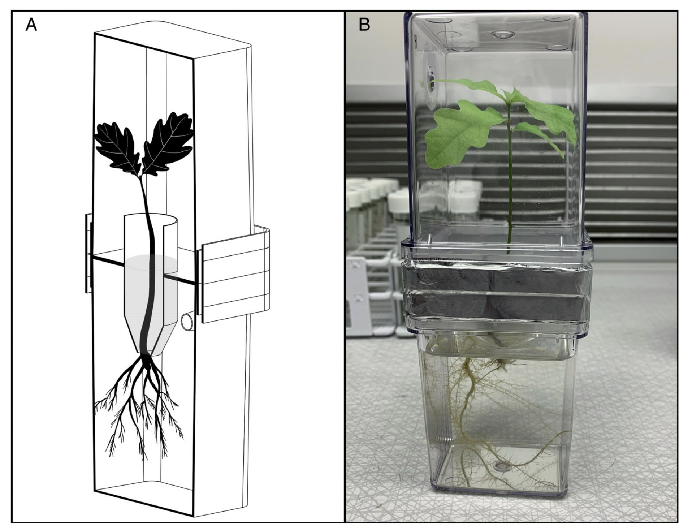
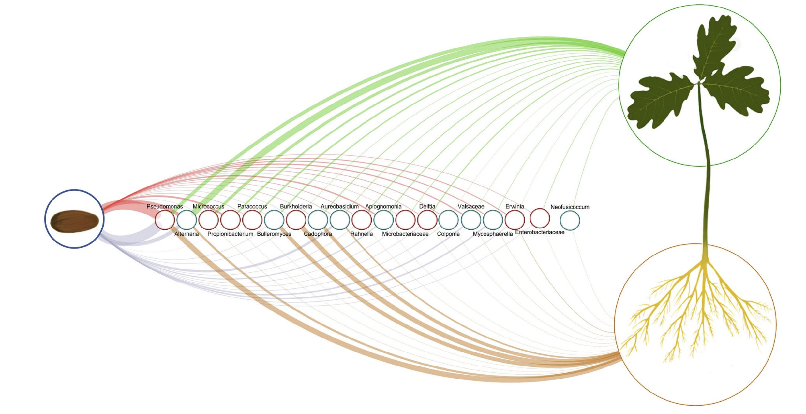

**Experimental evidence of microbial inheritance in plants and transmission routes from seed to phyllosphere and root**

Abdelfattah, A., Wisniewski, M., Schena, L. and Tack, A.J.M. (2021), Experimental evidence of microbial inheritance in plants and transmission routes from seed to phyllosphere and root. Environ Microbiol, 23: 2199-2214. https://doi.org/10.1111/1462-2920.15392

**Summary:**

This study looks at transmission of microbial communities via seeds and how they are then partitioned within developing seedlings. They utilize a segregated mesocosm to study whether the microbial community exisiting on oak acorns is transmitted to the developing seedling and if so, whether it is partitioned into separate communities above- and below-ground.

**Findings:**

Using amplicon sequencing of fungal ITS and bacterial 16S rDNA they found that the microbial community is diverse and non-randomly distributed within an acorn. Further, they found that the phyllosphere (aboveground) community is also diverse and similar to the community within the embryo portion of the acorn while the root community is distinct, less diverse, and resembles that of the pericarp.

**Why it's interesting:**

They utilize a creative method to examine how microbial communities differ both within seeds and then how they are transmitted to seedlings.